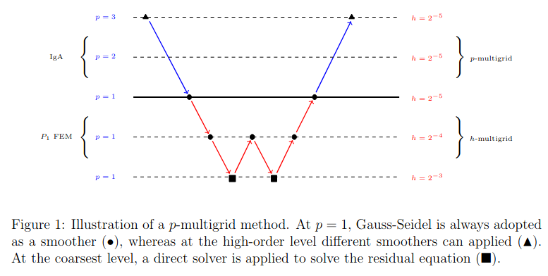
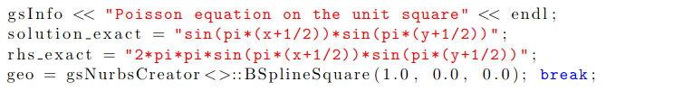
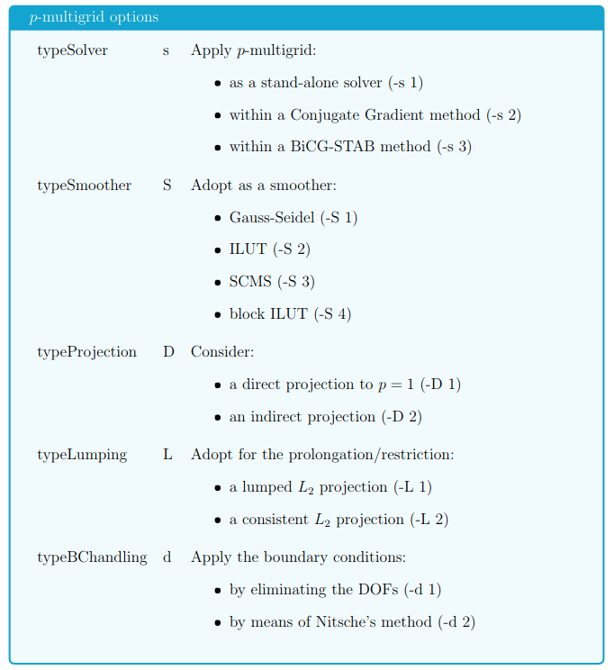
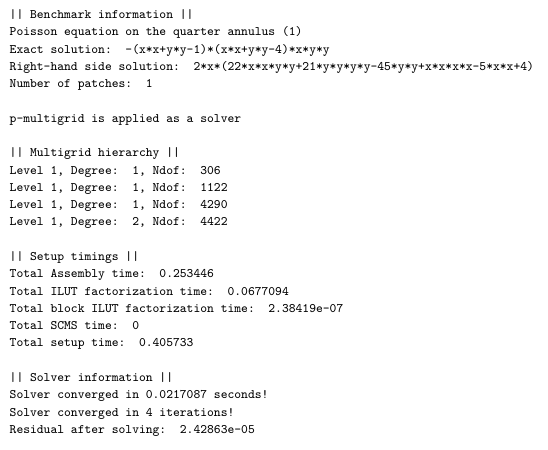
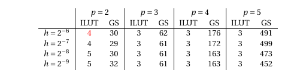
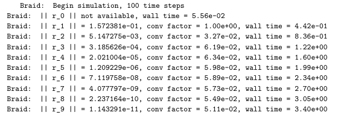
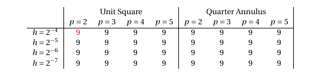

# Introduction
 
This README file contains a description to obtain the results presented in [1]. In particular, the 'pMultigrid_example' and 'xbraid_heatEquation_example' are discussed, which can be found in the 'p_multigrid' and 'xbraid' folder, respectively.  

The file starts with a general description of *p*-multigrid methods and then briefly discusses all arguments that can be provided by the user, after which both the 'pMultigridexample' and 'xbraid_heatEquation_example' are discussed in more detail. Please not that this README file shows many similarities with chapter 7 of [1].

# *p*-multigrid
In both examples, we consider the *p*-multigrid method as presented in [1,2]. *p*-multigrid methods are a class of iterative solvers that use a low-order correction to update the high-order solution.  At each level of the hierarchy, a basic iterative method (e.g.  Gauss-Seidel,ILUT) is applied which results in an overall efficient method.  Figure 1 illustrates a single iteration of a *p*-multigrid method.
 

 
As a model problem, we consider the convection-diffusion-reaction (CDR) equation, where  Dirichlet  (essential)  and  Neumann  (natural)  boundary  conditions  can be prescribed, respectively. In this tutorial we will explain how one can use a *p*-multigrid method to solve this model problem. We will explain how one can define the benchmark problem, setup the *p*-multigrid method and adjust it to their own preference. More information on *p*-multigrid methods can be found in [1,2]. Furthermore, we will discuss an example where *p*-multigrid methods are combined with the Multigrid Reduced in Time (MGRIT) method for time-dependent problems. 
 
Most of the parameters required to define the model problem and *p*-multigrid method can be provided via the command-line. Alternatively, one can adjust them in the main file, but this requires (re-)compiling the code. In the following, we will briefly discuss the different command-line arguments.
 
## Benchmark
 
Using the argument **-b "INT"** one can choose the considered benchmark problem.  Each problem  is  defined  by  the  exact  solution  ’solutionexact’,  considered  right  hand  side ’rhsexact’ and the underlying geometry ’geo’.  In total, five benchmarks can be adopted, but new ones can easily be added by the user. Typing **-b 2** in the command line leads for example to:
  

 
A  second  argument, **-P "INT"** defines  the  number  of  patches  considered. Starting from a single patch geometry, the geometry is split uniformly in each direction P times, with a maximum of 4 (= 64 patches). The benchmark problem above, where the geometry consists of 4 patches can thus be defined as follows:
  
 **-b 2 -P 2**
 
## *p*-multigrid hierarchy
  
To define the *p*-multigrid hierarchy, one first has to define the high-order discretization by choosing the degree of the B-spline basis functions and the refinement level by the command line arguments **-p "INT"** and **-r "INT"**, respectively. Then, a *p*-multigrid hierarchy is created by setting the number of levels in the multigrid hierarchy (using **-l "INT"**) and the coarsening strategy **-z "STRING"**. The string should have length **l−1** and defines if *p*-coarsening (”p”) or *h*-coarsening (”h”) should be applied. From left to right, the string starts with the coarsest level and ends with the finest one. 
  
The considered *p*-multigrid in Figure 1 is based on applying *h*-coarsening twice followed by applying *p*-coarsening twice afterwards and can be defined as follows:
  
**-p 3 -r 5 -l 5 -z "hhpp"**
  
In case a so-called direct projection [3] is adopted, the user should still provide the number  of  levels  and  coarsening  strategy  as  shown  above. The *p*-multigrid  hierarchy based on a direct projection will be formed internally by providing the argument **-D 1**, see the next section for more information. 
  
## p-multigrid options
 
The number of smoothing steps adopted within the *p*-multigrid method is defined by **-v "INT"**. It should be noted that the type of smoother chosen by **-S "INT"** is only used at high-order levels. At level p=1, Gauss-Seidel is always adopted as a smoother. One could adjust the *p*-multigrid method as follows:
  
**-s 1 -S 1 -D 1 -L 1 -d 1**
  
All other parameters and their meaning are provided in the table below.
 
  
  
## Example (pMultigridexample)
  
As an example, one can run the following code in the terminal:

**$ mkdir gismo_build_pmultigrid**

**$ cd gismo_build_pmultigrid**

**$ cmake ../p_multigrid/gismo/ -DCMAKE_CXX_STANDARD=14**

**$ make pMultigrid_example**
 
**$ ./bin/pMultigrid_example -p 2 -r 6 -l 4 -S 1 -b 2 -z "hhp"**
  
This would lead to the following output on the terminal:
  

  
Hence, Poisson’s equation is solved on a quarter annulus using a *p*-multigrid method combined with an ILUT  smoother. Of course, the times shown in the example  above differ from device to device. Note that the output in the terminal describes the benchmark problem, the *p*-multigrid hierarchy and details about the solver. By typing
  
**$./bin/pMultigridexample -p "INT" -r "INT" -l "INT" -S "INT" -b 2 -z "STRING"**
  
one can obtain the results for different discretizations. Table 1 shows the results for different values of *p* and *h* which can be reproduced by varying the different parameters in the terminal. The red colored 4 is the result corresponding to the output above.
  
 
 
 
## Example (xbraid_heatEquation_example)

In a similar way, results obtained with MGRIT can be obtained as well in the following way:

**$ mkdir gismo_build_xbraid**

**$ cd gismo_build_xbraid**

**$ cmake ../xbraid/gismo/ -DCMAKE_CXX_STANDARD=14 -DGISMO_WITH_MPI=ON -DGISMO_WITH_XBRAID=ON**

**$ make xbraid_heatEquation_example**

One can then run the following code in the terminal:

**$ mpirun -np 4 ./bin/xbraid_heatEquation_example -n 100 -i 2 -r 4**

This command runs the MGRIT method (using 4 processors) adopting 100 time steps, a refinement level of 4 and spline degree equal to 2. The obtained output provides all the details with respect to the settings of the MGRIT method and the p-multigrid method. A part of the output shows the convergence of the MGRIT method:

By typing

**$ mpirun -np 4 ./bin/xbraid_heatEquation_example -n "INT" -i "INT" -r "INT"**

one can obtain the results for different discretizations. It should be noted that this example makes use of an XML-file (heat2d_square_ibvp1.xml) which provides all the MGRIT and p-multigrid settings and should be adjusted accordingly. The table below shows the results for different values of p and h which can be reproduced in this example. Here, the red colored 9 is the result corresponding to the output above.

 ## Bibliography

 [1]  R. Tielen, *p*-multigrid methods for Isogeometric Analysis, *PhD thesis*, 2021

 [2]  R. Tielen, M. M&ouml;ller, D. G&ouml;ddeke, C. Vuik, *p*-multigrid methods and their comparisonto h-multigrid methods within Isogeometric Analysis, *Computer Methods in Applied Mechanics and Engineering*, Volume 372, 2020
 
 [3]  R. Tielen, M. M&ouml;ller, C. Vuik, A Direct Projection to Low-Order Level for *p*-Multigrid Methods in Isogeometric Analysis, *Lecture  Notes  in  Computational Science and Engineering: Numerical Mathematics and Advanced Applications ENUMATH 2019*, 2021
  
## Contact 
If you have any questions or remarks regarding this repository, please contact me: roeltielen@hotmail.com
 
